# 指令
为了提高开发效率，提供了一些前端指令，用于生成模块和页面。主要分为以下两步：
- 创建模块
- 创建页面（必须基于模块创建）
  
前端模块说明请参考[前端模块说明](https://hanta.yuque.com/px7kg1/dev/arsugbwm9dn5r13c)
## 创建模块
- 运行指令
    ``` bash
    pnpm create:module
    ```
- 选择module类型  
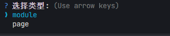

- 输入模块ID  


- 模块ID用于生成模块的目录名称，同时也会替换以下文件中的`${module-id}`
    ```xml
    <!-- pom.xml -->
    <artifactId>${module-id}</artifactId>
    ```
    `package.json`
    ```json
    {
        "name": "${module-id}",
        "id": "${module-id}"
    }
    ```
    `config.json`
    ```json 
    {
    "aliasName": "@${module-id}"
    }
    ```

- 输入模块名称


- 模块名称用于备注，同时也会替换pom.xml文件中的`${module-name}`
    ```xml
    <!-- pom.xml -->
    <name>${module-name}UI</name>
    <description>JetLinks ${module-name}UI模块</description>
    ```
- 构建完成
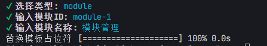
查看`src/modules`目录下，是否生成了模块目录
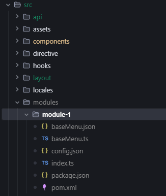
验证上述文件中的内容是否替换成功
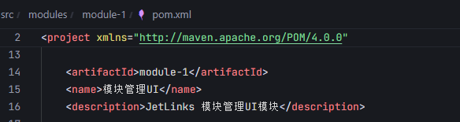
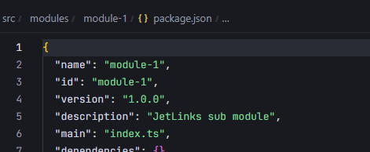

## 创建页面

- 运行指令
    ``` bash
    pnpm create:module
    ```
- 选择page类型   
  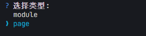

- 输入页面Code
     
  页面code用于生成页面的目录名称，同时对应的按钮权限标识比如 `const authkey = 'device'; // 权限标识`

- 输入页面名称   
  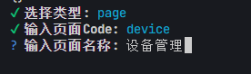
  页面名称和页面code用于生成初始化菜单数据
  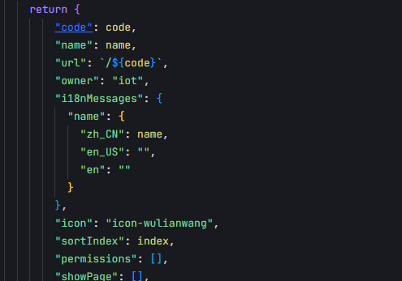

- 是否需要搜索功能   
  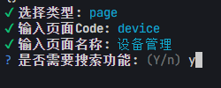

- 是否需要表格功能   
  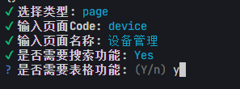

- 选择创建页面的模块   
  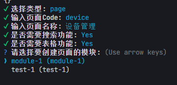

- 构建完成   
  查看`src/modules/views`目录下，是否生成了页面目录,baseMenu.json文件中是否生成了菜单数据
  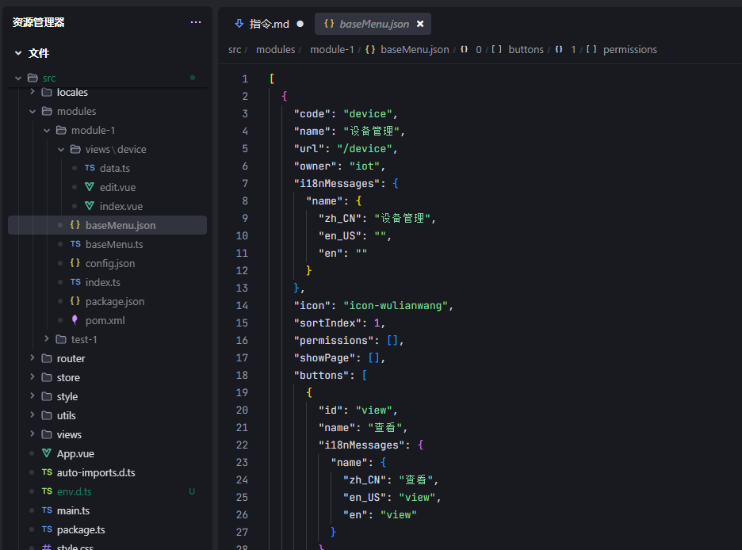
